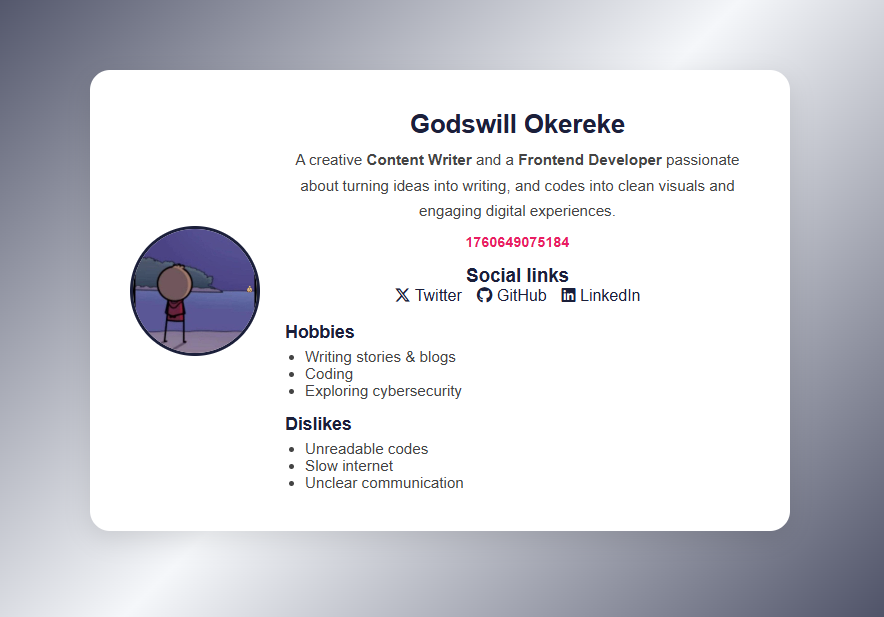

# 🌟 HNG Frontend Wizards — Stage 1: Multi-Page Application


This is my submission for the **HNG Internship 2025 (Frontend Wizards Track)** — **Stage 1 Task: Multi-Page Application**.  
This project builds upon **Stage 0** (Profile Card) and expands it into a **responsive, accessible, and testable multi-page application** with a Contact form and About page, using only **HTML, CSS, and Vanilla JavaScript**, following semantic and `data-testid` guidelines.

---

## 🧭 Table of Contents
- [📜 Task Description](#-task-description)
- [🧱 Built With](#-built-with)
- [⚙️ Features](#️-features)
- [🧾 Data Test IDs](#-data-test-ids)
- [🕒 JavaScript Logic](#-javascript-logic)
- [🎨 Screenshots](#-screenshots)
- [🚀 Live Demo & Repository](#-live-demo--repository)
- [🧭 How to Run Locally](#-how-to-run-locally)
- [👨‍💻 Author](#-author)
- [🏁 Submission](#-submission)

---

## 📜 Task Description

**Stage 1** expands the Stage 0 profile card into a **three-page application**:

### **Page 1: Home (index.html)**
- 👤 Name  
- ✍️ Short biography  
- 🕒 Current time (in milliseconds) using `Date.now()`  
- 🖼️ Avatar image  
- 🔗 Social media links (Twitter, GitHub, LinkedIn)  
- 💡 Hobbies  
- 🚫 Dislikes  
- 🔗 Navigation to Contact and About pages

### **Page 2: Contact (contact.html)**
- Fully validated contact form with:
  - Full Name (required)
  - Email (required, must be valid)
  - Subject (required)
  - Message (required, minimum 10 characters)
- Real-time error messages
- Success confirmation after valid submission
- Full ARIA accessibility

### **Page 3: About (about.html)**
- Personal bio
- Goals in the HNG program
- Areas of low confidence
- Note to future self
- Extra thoughts

All elements include specific `data-testid` attributes for automated testing.

---

## 🧱 Built With

- **HTML5** — for semantic structure and accessibility  
- **CSS3** — for layout, styling, and responsiveness (Flexbox + media queries)  
- **JavaScript (ES6)** — for real-time clock, form validation, and dynamic error handling  
- **Font Awesome** — for professional social media icons  

---

## ⚙️ Features

✅ Semantic and accessible HTML structure  
✅ Fully responsive layout (mobile → tablet → desktop)  
✅ Real-time milliseconds clock that updates every second with clock icon  
✅ Contact form with full client-side validation  
✅ Real-time field validation with visual indicators  
✅ Character counter for message field  
✅ Smooth error message transitions  
✅ ARIA accessibility (labels, aria-describedby, aria-live)  
✅ Enhanced keyboard navigation with visible focus states  
✅ Clean, modern card design with soft hover animations  
✅ Social links open in new tabs with secure `rel` attributes  

---

## 🧾 Data Test IDs (for HNG Automated Tests)

### **Home Page**
| Element | data-testid |
|----------|--------------|
| Profile card container | `test-profile-card` |
| User name | `test-user-name` |
| User bio | `test-user-bio` |
| Current time | `test-user-time` |
| Avatar image | `test-user-avatar` |
| Social links container | `test-user-social-links` |
| Twitter link | `test-user-social-twitter` |
| GitHub link | `test-user-social-github` |
| LinkedIn link | `test-user-social-linkedin` |
| Hobbies list | `test-user-hobbies` |
| Dislikes list | `test-user-dislikes` |
| About page link | `test-nav-about` |
| Contact page link | `test-nav-contact` |

### **Contact Page**
| Element | data-testid |
|----------|--------------|
| Name input | `test-contact-name` |
| Email input | `test-contact-email` |
| Subject input | `test-contact-subject` |
| Message textarea | `test-contact-message` |
| Submit button | `test-contact-submit` |
| Name error message | `test-contact-error-name` |
| Email error message | `test-contact-error-email` |
| Subject error message | `test-contact-error-subject` |
| Message error message | `test-contact-error-message` |
| Success message | `test-contact-success` |
| Home page link | `test-nav-home` |
| About page link | `test-nav-about` |

### **About Page**
| Element | data-testid |
|----------|--------------|
| Main container | `test-about-page` |
| Bio section | `test-about-bio` |
| Goals section | `test-about-goals` |
| Low confidence section | `test-about-confidence` |
| Future note section | `test-about-future-note` |
| Extra thoughts section | `test-about-extra` |
| Home page link | `test-nav-home` |
| Contact page link | `test-nav-contact` |

---

## 🕒 JavaScript Logic

### **Time Display (script.js)**

```js
function updateTime() {
  const currentTime = Date.now();
  const timeElement = document.querySelector('[data-testid="test-user-time"]');
  
  if (timeElement) {
    timeElement.innerHTML = `
      <i class="fas fa-clock"></i> 
      <span>${currentTime.toLocaleString()} ms</span>
    `;
  }
}
updateTime();
setInterval(updateTime, 1000);
```

- ✔️ Uses `Date.now()` exactly as required.
- ✔️ Updates automatically every second for live accuracy.
- ✔️ Displays with clock icon and formatted numbers.

### **Form Validation (contact.js)**

```js
// Validates all fields on form submission
// Provides real-time error messages
// Shows success confirmation after valid submission
// Includes character counter for message field
// Visual feedback with valid/invalid states
```

- ✔️ All fields required
- ✔️ Email format validation
- ✔️ Message minimum 10 characters
- ✔️ ARIA accessibility with aria-describedby and aria-live

---

## 🎨 Screenshots



---

## 🚀 Live Demo & Repository

🌐 Live URL: 
```
https://kontractour.github.io/profile-card/
```

💾 GitHub Repo: 
```
https://github.com/Kontractour/profile-card
```

---

## 🧭 How to Run Locally

1. Clone this repository:

```bash
git clone https://github.com/Kontractour/profile-card.git
```

2. Open the folder:

```bash
cd profile-card
```

3. Launch `index.html` in your browser.

---

## 👨‍💻 Author

Godswill Okereke  
Frontend Developer & Content Writer

- 🌐 [LinkedIn](https://www.linkedin.com/in/godswill-okereke-3ba33b37a)
- 💻 [GitHub](https://github.com/Kontractour)
- 🔗 [Twitter](https://x.com/Kontractour)

---

## 🏁 Submission

This project fulfills all **HNG Stage 1 requirements**, including:

### **Contact Page**
- ✅ Correct `data-testid` attributes for all fields and error messages
- ✅ Form validation (all fields required, email format, message length)
- ✅ Success message display after valid submission
- ✅ ARIA accessibility (labels with `for`, `aria-describedby`, `aria-live`)
- ✅ Keyboard accessible

### **About Page**
- ✅ Wrapped in `<main data-testid="test-about-page">`
- ✅ All 5 required sections with correct `data-testid` attributes
- ✅ Semantic HTML structure (section, h2, h3, p)
- ✅ Proper heading hierarchy

### **General**
- ✅ Semantic and accessible HTML structure
- ✅ Responsive, testable layout
- ✅ Keyboard navigable with visible focus states
- ✅ Continuation and upgrade from Stage 0

```
Built with clean code, creativity, and attention to detail. ✨
```

**Stage 0 → Stage 1 Progression Complete**
